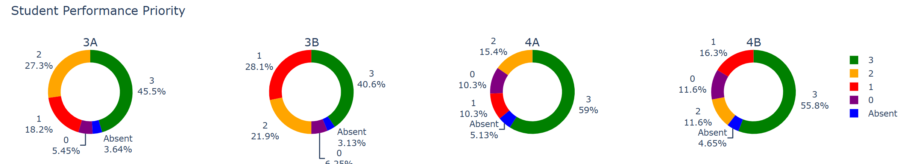

# E-Shuleni-Dashboard



## Overview

This project provides automated data processing and visualization tools for tracking student learning progress in the E-Shuleni pilot program (2025) in Tanzania. The dashboard processes student data from Enuma LMS to help educators monitor student performance, identify students needing intervention, and track learning progression over time.

## Project Structure

The project contains two main Jupyter notebooks that work together to create a comprehensive student monitoring system:

### 1. `pdf_automation_E-Shuleni.ipynb` - Weekly Progress Report Automation

**Purpose**: Extracts and processes weekly student performance data from PDF progress reports.

**What it does**:
- Extracts student data from weekly PDF progress reports for all 4 streams (3A, 3B, 4A, 4B)
- Calculates performance metrics (lessons completed, test scores, time on program)
- Flags students by priority level based on performance:
  - **Priority 0 (Purple)**: Less than 1 hour on program
  - **Priority 1 (Red)**: Overall percentage score < 50%
  - **Priority 2 (Yellow)**: Overall percentage score 50-75%
  - **Priority 3 (Green)**: Overall percentage score ≥ 75%
- Generates interactive pie charts showing student distribution across priority levels
- Creates intervention tables for tracking student support
- Supports week-over-week comparison by subtracting previous week's data
- Removes students who left the program
- Exports processed data to Excel files

**How to use**:
1. Place weekly PDF progress reports in the appropriate month folder (e.g., `./../Pilot 2025/Data Enuma LMS/October/`)
2. Update the configuration variables in the notebook:
   - `month` (e.g., "October")
   - `month_abrev` (e.g., "oct")
   - `date` (e.g., "31")
3. Run **Case 1** cells if this is the first week of the month (no subtraction needed)
4. Run **Case 2** cells if comparing to a previous week (sets `last_date_test` for comparison)
5. The notebook will generate:
   - Excel files with processed student data
   - Interactive HTML pie charts (saved to dashboard plots folder)
   - Intervention tables for educator use

### 2. `update_dashboard.ipynb` - Student Progress Dashboard

**Purpose**: Creates comprehensive visualizations of student learning progression over time.

**What it does**:
- Loads CSV files containing student level tracking data from the Enuma LMS
- Processes data separately for Grade 3 and Grade 4 students
- Tracks student progression through learning levels (Introductory through Level 25)
- Incorporates absenteeism data
- Creates interactive timeline visualizations showing:
  - **Level progression**: Student advancement through curriculum levels over time
  - **Performance trends**: Overall percentage scores tracked weekly
  - **Lesson completion**: Number of lessons completed per student
  - **Priority 0 student focus**: Dedicated plots and heatmaps for students needing urgent intervention
- Generates heatmaps showing priority level history for each student
- Identifies bottom performers at current date
- Marks holiday periods on visualizations
- Exports all visualizations as interactive HTML files

**How to use**:
1. Ensure CSV level tracking files are placed in `./../Pilot 2025/Data Enuma LMS/track levels/`
2. Ensure Excel performance report files are in `./../Pilot 2025/Data Enuma LMS/track performance/`
3. Update the out of school kids table at `./../Pilot 2025/Data Enuma LMS/students_out_of_program_2025.xlsx` (can be seen in drive)
4. Run all cells in the notebook
5. The notebook will generate interactive HTML dashboards saved to `./../E-Shuleni-Dashboard/plots/`:
   - `tracking_levels_Grade 3.html` / `tracking_levels_Grade 4.html`
   - `tracking_perf_Grade 3.html` / `tracking_perf_Grade 4.html`
   - `tracking_lessons_Grade 3.html` / `tracking_lessons_Grade 4.html`
   - `tracking_heatmap_Grade 3_p0.html` / `tracking_heatmap_Grade 4_p0.html`

## Prerequisites

**Required Python packages**:
```
pypdf
PyPDF2
numpy
pandas
matplotlib
seaborn
plotly
tqdm
regex
openpyxl (for Excel file handling)
```

Install with:
```bash
pip install pypdf PyPDF2 numpy pandas matplotlib seaborn plotly tqdm regex openpyxl
```

## Data Requirements

The notebooks expect the following data structure:

```
./../Pilot 2025/Data Enuma LMS/
├── track levels/              # CSV files with student level data (weekly exports)
├── track performance/         # Excel files with student performance data
├── [Month]/                   # Monthly folders (e.g., October, November)
│   └── progress_reports_[month]_[stream]_[date].pdf
├── absenteeism table.xlsx     # Student attendance tracking
└── students_out_of_program_2025.xlsx  # Students who left the program
```

## Workflow

**Weekly Data Processing Workflow**:
1. Export weekly PDF progress reports from Enuma LMS
2. Run `pdf_automation_E-Shuleni.ipynb` to process the PDFs and generate priority metrics
3. Export level tracking CSV files from Enuma LMS
4. Update the absenteeism table if needed
5. Run `update_dashboard.ipynb` to generate comprehensive visualizations
6. Review the generated HTML dashboards to monitor student progress
7. Use intervention tables to plan student support

## Output Files

**Excel Files**:
- `progress_reports_[month]_all_streams_[date].xlsx` - Consolidated weekly performance data
- `intervention_table_[month]_[date].xlsx` - Student intervention tracking

**Interactive HTML Dashboards**:
- Level progression charts (Grade 3 & 4)
- Performance priority distribution (pie charts)
- Lesson completion trends (Grade 3 & 4)
- Priority 0 student heatmaps (Grade 3 & 4)

All HTML files can be opened in any web browser and include interactive features like zooming, filtering by student, and hover details.

## Notes

- The notebooks automatically filter out students who have left the program
- Grey zones in timeline plots indicate school holiday periods
- Priority 0 students (those with minimal program engagement) receive special tracking and visualizations
- All date handling assumes the 2025 academic year format
